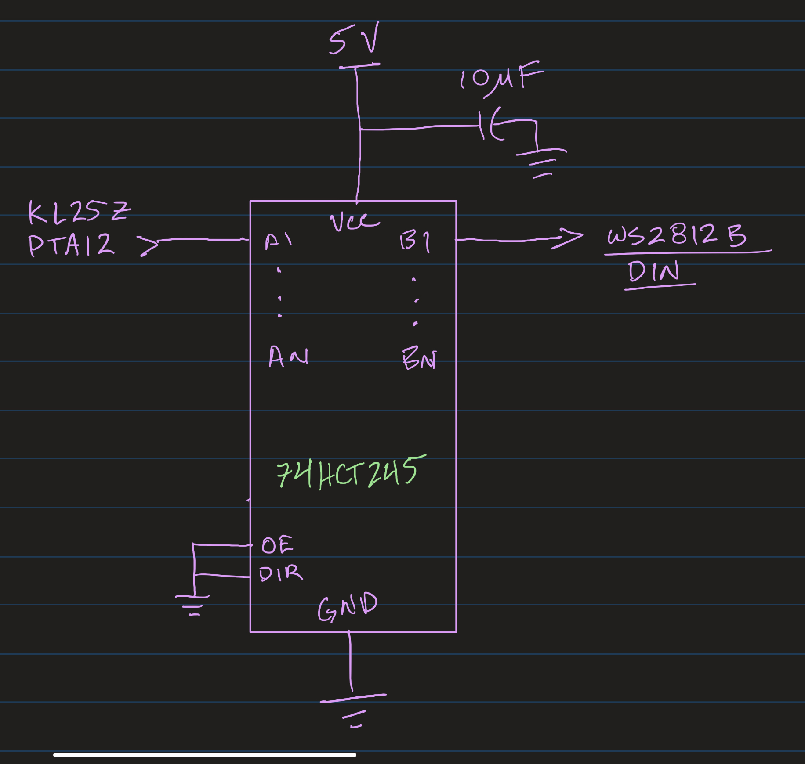
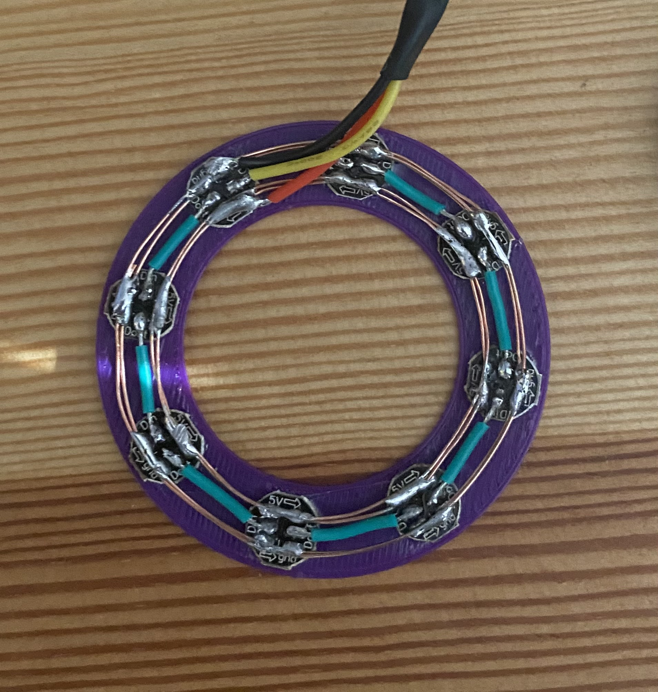
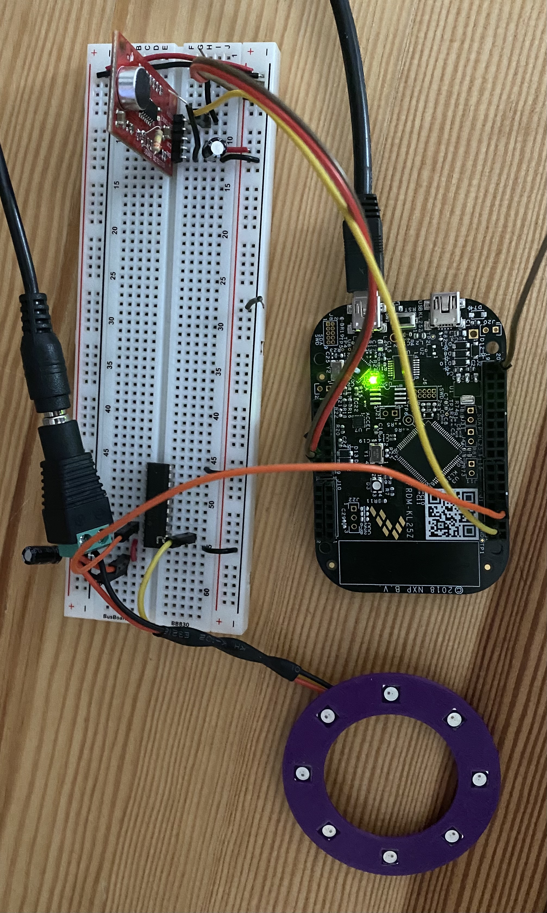
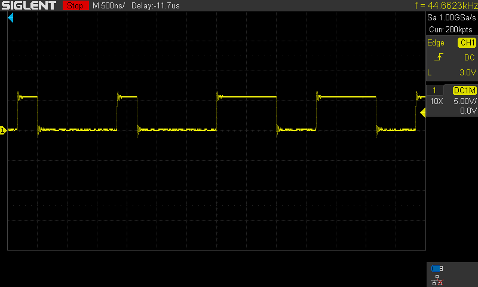

- - - - 
# Principals of Embedded Software Final Project #
#### Code for Final Project for PES, ECEN-5813, Fall 2020 ####
#### Author: Jake Michael ####

- - - -
### Introduction ###
This repository contains code for my Final Project for ECEN 5813 (Principles of Embedded Software) at CU, Boulder for Fall 2020. The ultimate goal for the project was to use several of the topics discussed throughout the course to create something interesting for the FRDM-KL25Z development platform. My idea for the project was to do music visualization using a microphone, the ADC and some LEDs. This project utilizes several of the topics discussed in the course. Specifically, I used several of the hardware peripherals integrated into the KL25Z board including the analog to digital converter (ADC), the pulse width modulation peripheral (PWM or TPM), and direct memory access (DMA) to get a highly performant and responsive music visualization output to the LEDs in real time. 

- - - - 
### Hardware ### 
This project utilized various hardware components, listed below:
* FRDM-KL25Z development board.
* [Sparkfun Sound Detector](https://www.sparkfun.com/products/12642) microphone module.
* [WS2812B's](https://www.digikey.com/en/datasheets/parallaxinc/parallax-inc-28085-ws2812b-rgb-led-datasheet), popularly known as Neopixels.
* [74HCT245 IC](https://www.digikey.com/en/products/detail/texas-instruments/CD74HCT245E/38454) for 3.3 V to 5 V logic level conversion for Neopixels.
* 5V, 2A DC power supply.

The Sound Detector Module output was wired to the analog input pin of the KL25Z (Port C, Pin 0). Since Neopixels are typically driven with a 5 V power source at 5 V logic, the 74HCT245 was used to convert the logic level. This is a high quality (fast response time) CMOS Logic Octal-Bus Transceiver. The KL25Z output pin that drives the Neopixels is Port A, Pin 12. The schematic below shows the circuit design for logic level conversion:

  

Finally, I 3D printed a neopixel ring mount and soldered together 8 neopixels. Here are a few photos of the final breadboard and Neopixel ring:

  

- - - -
### Software ###

#### Performance Tradeoffs ####
The software design for the project was heavily influenced by the performance goals. The main premise behind the software was to sample the ADC at 48 kHz, run it through a Fast Fourier Transform (FFT) to deduce the power spectrum and update the neopixel ring based on the magnitudes attained from the power spectrum, all done as fast as possible to create a nice responsive visualization effect. Therefore, I settled on using the Real FFT implementation via the [CMSIS libraries](https://www.keil.com/pack/doc/CMSIS/DSP/html/group__RealFFT.html). Although I could have written my own optimized fixed point FFT, I settled on using the library because it is written by the chip manufacturer in a highly optimized manner and there was no strong compelling reason to reinvent the wheel. 

The one hardware technology in the KL25Z that really made this project responsive was DMA. Instead of just sampling the ADC in a polling loop, I used DMA and a ping-pong buffering scheme to sample the ADC in the background while the main loop was computing the FFT on the previous samples and generating the LED output buffer. Once the neopixel output buffer is computed, I used another DMA channel to automatically update the duty cycle of the PWM waveforms to generate the proper bitstream for the neopixels.

For the analog sampling, DMA0 is triggered by TPM0 overflow at a 48 kHz sampling rate and the samples are placed in the background ping-pong buffer (while the main loop is computing FFT of previous samples in the active ping-pong buffer and generating the LED output buffer). Once the LED output buffer is computed, DMA1 is initiated by TPM1 overflow to update the pulse widths for the neopixel bitstream. This all means that the processor doesn't have to spend time polling the ADC or bit-banging a GPIO line and can be reserved for computationally challenging tasks such as the FFT.

#### Testing ####
Although I used an external CMSIS library for the FFT, it was important to verify that the library was working as expected. I used Python to compute and compare results between the FFT output in C and an FFT of the same dataset in Python. There is a Jupyter Notebook [DSP_Validation.ipynb](DSP_Validation.ipynb) that accompanies this documentation which walks through the DSP validation of the CMSIS FFT. This notebook also includes the code that generates the Hanning window that gets applied to the samples before computing the FFT. 

In addition to testing the CMSIS library, I used an oscilloscope to verify that the output waveforms to the Neopixels were within the specification. This was a critical tool for use in debugging this portion of the project and I likely could not have generated the proper neopixel timing without it. The below scopeshot shows the neopixel 1's and 0's:

#### Recommended Prerequisites ####
This code should be run on the NXP FRDM-KL25Z development board and built with NXP's MCUxpresso IDE.

#### Compiling and Running the Code: ####
The user should run the code after importing the project into NXP's MCUxpresso IDE. After cloning the git repository do the following to compile and run the code:
1. Place the cloned directory in the active workspace for your MCUxpresso configuration. 
2. In MCUxpresso go to `File->Import` then select `General->Existing Projects into Workspace`. 
3. Browse for the file directory of the cloned git repository, select the project and finish the import wizard.
4. Now you should be able to see the project in the IDE workspace. The code is now ready to be built and run / debugged from the IDE. 

- - - -
### Acknowledgements ###
I would like to thank the instructor Howdy Pierce and the TA's Saket Penurkar and Rakesh Kumar for a great semester! I truly enjoyed the course and want to thank them for all of their time and effort spent making the course worthwhile.  
- - - -

- - - - 
### Project Link: [https://github.com/jmichael16/PES-Final-Project](https://github.com/jmichael16/PES-Final-Project) ###
- - - -
